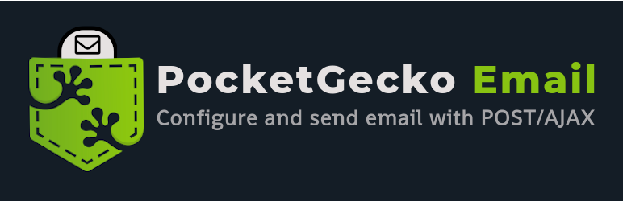

# PocketGecko Email

> WordPress plugin that provides an email settings page to configure `wp_mail` and simplifies sending emails using POST or AJAX. 

## Description

This is the development repo for [PockgetGecko Email](https://wordpress.org/plugins/pocketgecko-email). 

## Plugin Features

- WordPress admin panel settings menu (`Settings -> Email`)
- Send test emails on the admin menu
- Display success or error notifications on the admin menu to help with debugging
- Supports Cc, Bcc and multiple attachments
- Endpoint at `/wp-admin/admin-post.php` that accepts POST requests and calls `wp_mail`.
- Endpoint at `/wp-admin/admin-ajax.php` that accepts AJAX requests and calls `wp_mail`.
- Front end JavaScript functions for posting forms and sending emails using AJAX.
- Security conscious: limits functionality for non-admin users and does not accept requests from external hosts.


## Usage


```
git clone https://github.com/axiomattik/pocketgecko-email.git
cd pocketgecko-email/
npm install dev
```

If you have a local WordPress development server running at `localhost:8000` then from the repo's root directory you can run `gulp`, which will build the plugin and then use BrowserSync to serve the plugin, automatically re-building any changes and refreshing your browser.

To install the plugin (after running `gulp build`) to your local WordPress server, use a symlink. For example:

```
cd ~/pocketgecko-email/
ln -s ./bld/pocketgecko-email/ ~/my-wp-project/wp/wp-content/plugins/pocketgecko-email
```


## Requirements

- local WordPress server served at localhost:8000
- node v12.18.3

